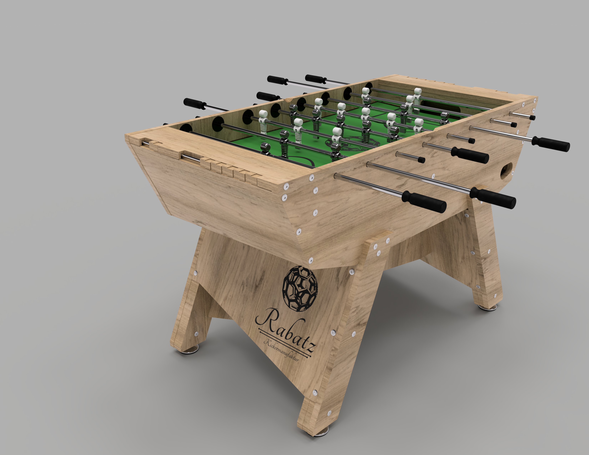

# Rabatz Table Soccer

*Production files and assembly instructions*

## Project links

- [Design reference](https://www.rabatzdesign.com)
- [Production files](https://github.com/rabatzfunctionaldesign/rabatz_tablesoccer) _(you are here)_

## Preview

## Production steps

- 01 CNC-milling
- 02 Surface finishing
- 03 Playing field assembly
- 04 Table soccer assembly

## Base of materials

- 2 sheets plywood birch 2500 x 1250 x 24 mm
- 1 sheet medium dense fiber board 1200 x 700 x 19 mm
- Accessory package _(Check [assembly instructions](https://github.com/rabatzfunctionaldesign/rabatz_tablesoccer/04_Assembly/04_Assembly_en.pdf) to obtain a detailed list of all parts. A package with the required accessory collected can be ordered [here](https://www.rabatzdesign.com))_

## Copyright & License

&copy;Andr&eacute; Mirtschink
info@rabatzdesign.com

Shield: [![CC BY-NC-SA 4.0][cc-by-nc-sa-shield]][cc-by-nc-sa]

This work is licensed under a
[Creative Commons Attribution-NonCommercial-ShareAlike 4.0 International License][cc-by-nc-sa].

[![CC BY-NC-SA 4.0][cc-by-nc-sa-image]][cc-by-nc-sa]

[cc-by-nc-sa]: http://creativecommons.org/licenses/by-nc-sa/4.0/
[cc-by-nc-sa-image]: https://licensebuttons.net/l/by-nc-sa/4.0/88x31.png
[cc-by-nc-sa-shield]: https://img.shields.io/badge/License-CC%20BY--NC--SA%204.0-lightgrey.svg
