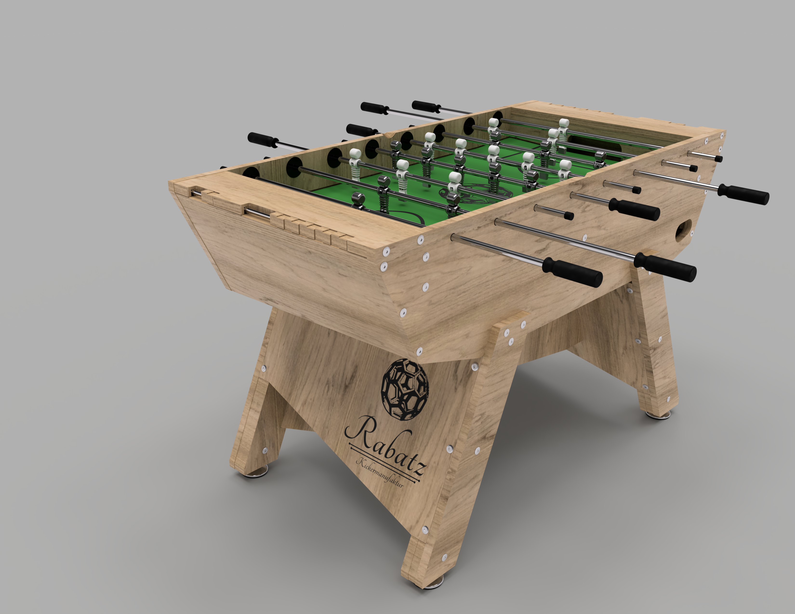

# Rabatz Table Soccer

*Production files and assembly instructions*

## Project links

- [Design reference](https://www.rabatzdesign.com)
- [Production files](https://github.com/rabatzfunctionaldesign/rabatz_tablesoccer) _(you are here)_

## Preview

## Production steps

- 00 [Base of Materials](https://github.com/RabatzFunctionalDesign/rabatz_tablesoccer/blob/main/Base_of_Materials.pdf)
- 01 CNC-milling
- 02 Surface finishing
- 03 Playing field assembly
- 04 Table soccer assembly

## Copyright & License

&copy;Andr&eacute; Mirtschink
info@rabatzdesign.com

This work is licensed under a
[Creative Commons Attribution-NonCommercial-ShareAlike 4.0 International License](http://creativecommons.org/licenses/by-nc-sa/4.0/)
